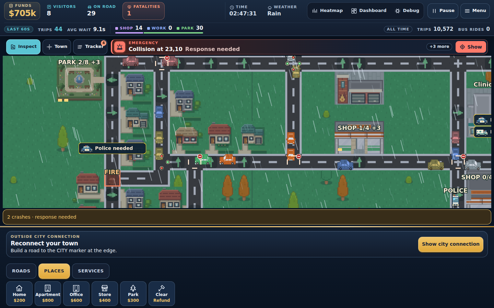
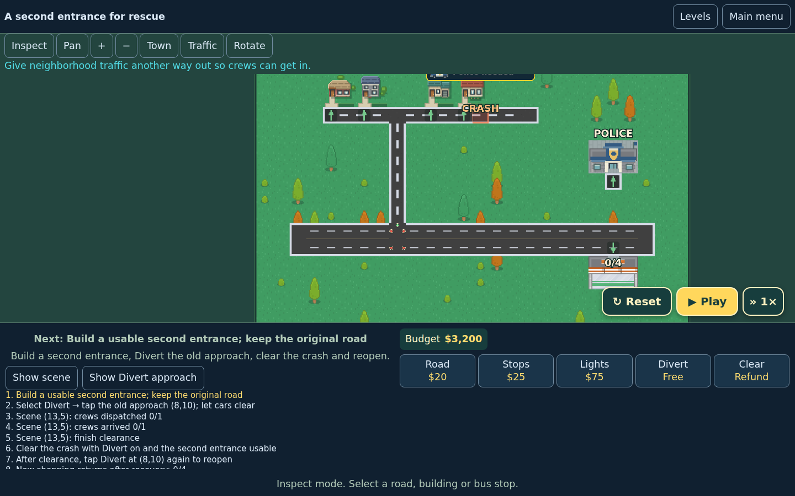
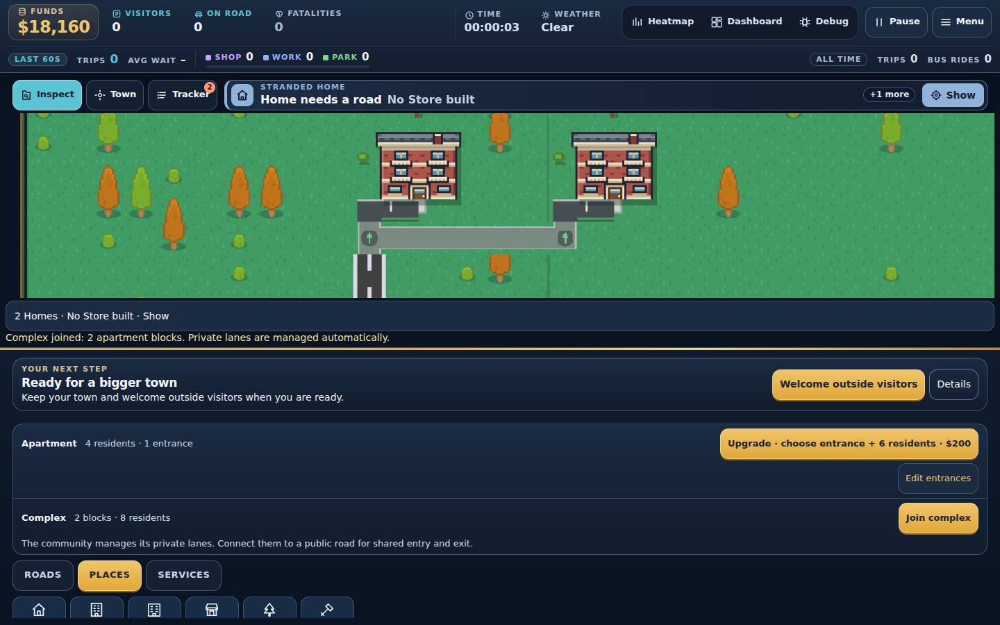
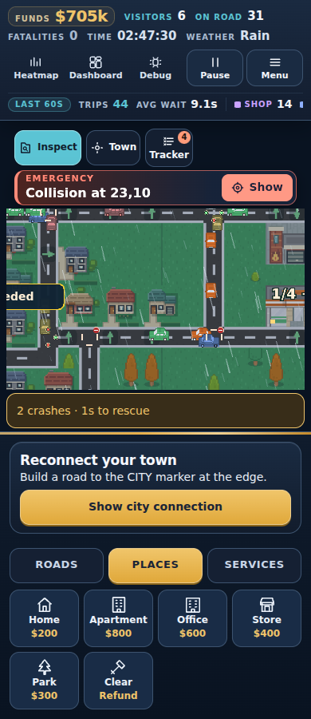

# Working ON IT!

**Fix the commute. Take the credit.**

A browser city-building and traffic puzzle game made for the September 2026 RUN.world jam. Build a town, watch where people get stuck, and improve the roads so everyday journeys and emergency crews can get through. Your manager, **The Man**, is always ready to take the credit.

Built with TypeScript, PixiJS, React, and Vite, with human creative direction and AI-assisted design, implementation, artwork, and review. This repository contains the game **and the decisions behind it**, so the next contributor can pick up the work without reconstructing a long chat history.



*Actual local gameplay capture from an isolated verification town. Screenshots show development builds; the version on RUN.world may differ.*

## The game

- **Build freely in Sandbox:** homes, stores, parks, offices, apartment complexes, and land expansion through on-map For sale signs.
- **Solve traffic problems:** two- and four-lane roads, one-way streets, roundabouts, stop signs, traffic lights, diversions, and bus routes.
- **Keep emergency access open:** police, fire, and clinic crews must travel to incidents and complete their work.
- **Learn through 25 beginner missions:** progress from simple connections to apartment access and emergency recovery, ending with a finale that accepts different successful layouts. Each permanent mission award opens the next level.
- **Enjoy the atmosphere:** pixel art, visual weather, and a radio whose full playlist is free for the jam.

The core loop is **build → observe → diagnose → improve → watch the result**. Economy values remain provisional; deeper financial balancing is planned for after the jam.

<details>
<summary>More screenshots: missions, apartments, and the phone layout</summary>



*An emergency lesson with explicit stages, a forgiving budget, and real responder access requirements.*



*Apartment complexes share automatic private lanes; the player connects those lanes to public streets.*



*The same simulation with a portrait interface.*

</details>

## Getting started

The repository provides a locked Nix development environment for **x86-64 Linux, including Ubuntu under WSL**. Enable Nix flakes, then:

```bash
git clone https://github.com/MelvynAndrew99/WorkingOnIT-Game.git
cd WorkingOnIT-Game
nix develop
npm ci
npm run dev
```

Open the URL Vite prints, normally `http://localhost:5173`. The shell supplies Node.js 24, npm, and the pinned RUN CLI. `make run` is a shortcut for `npm run dev`. Local gameplay works in a plain browser without a RUN account or deployment credentials.

Choose **Missions** for guided puzzles or **Sandbox** to build a town. Select a construction tool and click or tap to place it; drag to paint roads. **Inspect** selects existing roads, buildings, and bus stops. Selecting the active construction tool again, or pressing **Escape**, returns to inspection. Use **Rotate / R** for orientation, **Pan** to explore, and the wheel, pinch, or +/− to zoom. **Town** brings the camera back to your construction.

Run checks from the same Nix shell:

```bash
npm test               # Model and regression tests
npm run build          # Typecheck and RUN-integrated production build
npm run build:bundled  # Typecheck and standalone production build
npm run preview        # Serve the most recent build
```

For a standalone production preview, run `npm run build:bundled` before `npm run preview`. Neither build command publishes the game. See [contributing](CONTRIBUTING.md) for focused checks and recorded test limitations.

## How we made it

The project grew through playable iterations: a small road-and-building model, visible journeys, traffic controls and crashes, emergency recovery, guided missions, and richer buildings. Player feedback became recorded requirements, implementation tasks, and regression cases.

The work has involved **Codex, installed Claude Code, and Grok Build**, with human decisions guiding scope, tone, and acceptance. Contributions vary by task: Claude delivered UI and building artwork; Grok contributed implementation drafts and weather work; Codex handled simulation work, integration, corrections, and verification. The [apartment delivery](docs/apartments/README.md), [weather record](docs/weather/README.md), and [shared implementation lessons](docs/IMPLEMENTATION-LESSONS.md) document concrete work and its limits. Music was generated by the creator through Suno and integrated from supplied audio; see the [audio brief](docs/AUDIO-BRIEF.md) and [radio record](public/audio/radio/README.md).

The reusable skills in this project are captured as **documented workflows**: briefing bounded tasks, keeping simulation and visuals separate, reproducing a saved-town bug, checking real journeys, and handing off evidence. The repository currently uses Markdown instructions and design records rather than a checked-in `SKILL.md` package. Personal AI tools and subscriptions are optional; they are not prerequisites for contributing.

The aim is to make the context reusable, so a contributor can describe a change in ordinary language and point to the relevant documents. For example:

> Read AGENTS.md and the saved-city debugging guide. Reproduce this bus-stop issue in an isolated fixture, preserve existing passengers and saves, and propose a fix with a regression check.

That gives a person or assistant the goal, constraints, and expected evidence. Questions and judgment still matter, but the project's intent does not have to be rediscovered through prompt engineering.

## Design choices and where to read them

| Choice | Why it matters | Project record |
| --- | --- | --- |
| Real physical journeys | A connected graph alone is not success: cars must return, and responders must arrive and finish work. | [Traffic rules](docs/TRAFFIC-RULES.md) |
| Simulation independent of artwork | Footprints, entrances, occupancy, and saves remain authoritative when sprites change. | [Architecture](CLAUDE.md), [apartment implementation](docs/apartments/README.md) |
| Readable problems and creative fixes | Teach causes through forgiving missions; accept different legal solutions where the lesson allows them. | [Mission design](docs/challenges/MISSIONS.md), [25-mission delivery](docs/challenges/jam-25/README.md) |
| Growth creates planning tradeoffs | Wider streets use land; shared apartment lanes still need public access; buildings and alternate approaches compete for space. | [Four-lane design](docs/roadworks/FOUR-LANE-DESIGN.md), [bounded land](docs/land-progression/BOUNDED-MAP.md) |
| Preserve player progress | Fixes should retain towns, journeys, and earned awards, with explicit handling of revised missions. | [Saved-city debugging](docs/SAVED-CITY-DEBUGGING.md), [shared lessons](docs/IMPLEMENTATION-LESSONS.md) |
| Human direction with reviewed AI work | Record accepted decisions, rejected approaches, ownership, and verification so another contributor can continue. | [Project instructions](AGENTS.md), [design](docs/DESIGN.md) |

**Start with [AGENTS.md](AGENTS.md)** for the latest decisions, then the relevant design and delivery documents. Some files retain dated proposals and superseded milestones; read their status and newer corrections before treating an idea as implemented. [BACKLOG.md](docs/BACKLOG.md) tracks future work.

For code navigation: `src/game/` contains the model, traffic, incidents, challenges, and Pixi scene; `src/ui/` contains React controls; `src/state/` handles shared state and saves; `src/audio/` handles audio; `public/` contains runtime assets. [CLAUDE.md](CLAUDE.md) includes platform architecture and a clearly marked historical starter reference.

## Contributing and pull requests

Contributions are welcome: bug reproductions, playtesting, clearer lessons, documentation, accessibility improvements, artwork, and code. You do not need to use AI.

1. Read the project instructions and the design record for your area. Discuss larger gameplay or architecture changes in an issue before implementing them.
2. Fork the repository and create a focused branch. Include a concrete problem or player outcome with the change.
3. Verify the affected behavior and update the relevant docs. Include screenshots for visible changes and regression coverage for simulation or save fixes.
4. Open a pull request explaining **what changed, why, how it was checked, and any remaining limitations**. Mention meaningful AI assistance and what you personally reviewed.
5. Use review to challenge assumptions, discuss tradeoffs, and refine the implementation before a maintainer merges it.

**AI assistance does not replace collaboration or responsibility.** A PR is where people can inspect the actual change, understand the reasoning, and disagree constructively. The contributor remains responsible for submitted code and assets; generated output needs the same review as any other contribution.

See [CONTRIBUTING.md](CONTRIBUTING.md) for the full workflow, validation guidance, and a copyable PR outline.

## Releases and credits

The configured GitHub workflow tests and builds pushes to `main`, then creates a release archive if checks pass. It currently has no pull-request trigger, so contributors must provide local validation. RUN publication is a separate maintainer action; `make publish` / `npm run deploy` builds and uploads. See [release setup and recovery](docs/releases/PIPELINE.md).

The game builds on the RUN jam starter and retains its SDK lifecycle and save integration. The original pre-pivot AI Overlord source is preserved in [the archive](archive/ai-overlord/README.md). Template terms are in [LICENSE.txt](LICENSE.txt); asset provenance and production notes live alongside their respective assets and delivery documents.
