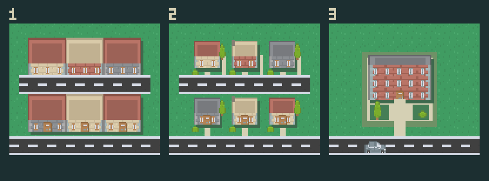
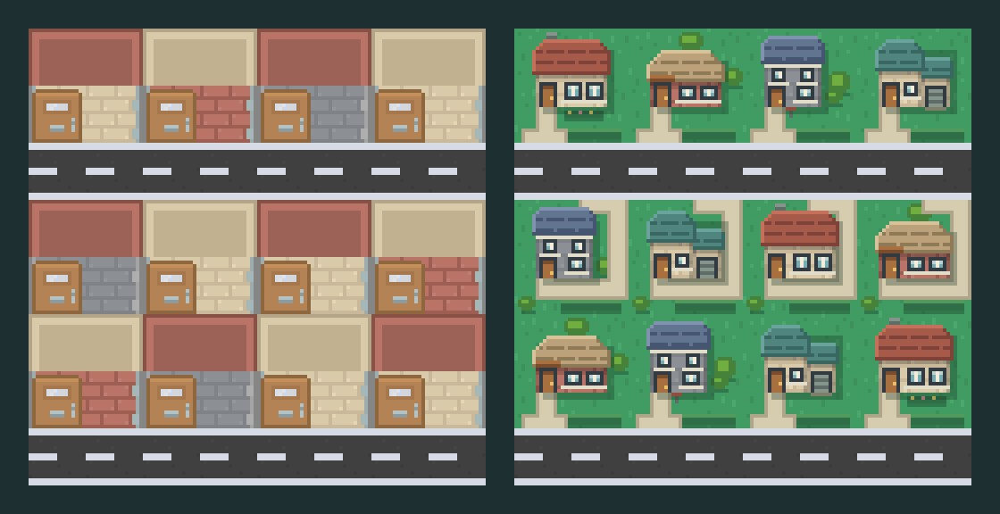

# Housing and neighborhoods — candidate study

2026-09-11. User requests improving clustered housing, checking included Kenney assets first, neighborhood planning with one or multiple entryways, and a larger apartment complex generating more cars.

## Actual inspection

Inspected both packs' Sample.png scenes, the atlas builder, cityArt.ts buildingPieces, cityScene.ts drawBuilding and the model footprint table. Modern City supplies compatible modular roofs, brick/stone/sand facades, windows, doors, trees and bushes. Urban's sample has a different, more saturated architectural palette; it is not an obvious drop-in improvement. This was not an exhaustive inspection of every unused tile.

Current homes occupy 2×2 simulation tiles. Their composed roof and facade fill essentially that entire rectangle, over a fully paved plot. Four skins vary colors but not silhouettes. Only south-facing homes show a door; other orientations have a paved apron. Tight repeated plots therefore look like one continuous building mass, and the access arrow bears most of the entrance explanation.

## Visible candidate

1. Approximation of the current full-plot building composition, not a runtime screenshot.
2. Kenney composition study: inset houses on the same lots, garden gaps, modest roof variation, shrubs and paths.
3. Proposed 4×4 apartment lot: three-floor brick facade, courtyard and clear street access.

Authored locally by Codex using the existing Kenney atlas and native pixel-composition helpers. No Claude or image-generation service was used. Editable generator: preview.mjs. Run `node docs/artwork/housing/preview.mjs` from the repository root. Existing source sheets and runtime atlas are untouched. Preview inspected at 3× nearest-neighbor scale. It is a composition study, not finalized directional art: all four real entrance positions still need careful path/door treatment before adoption. Keep artwork upright when entrances rotate, per existing user preference.

## Proposed next mechanics

- Preserve ordinary 2×2 house footprints and saved demand when changing their art. Use stable appearance variants, not random changes on reload. Bake lot art into cached textures like existing buildings.
- Let neighborhoods emerge from player-built local roads: a loop or branching layout can have one connection to the arterial, or several. Connections must remain actual road tiles with normal routing, controls and emergency access. A second connection gives an alternative only when the road network really supports it. A neighborhood prefab or separate neighborhood ownership system is not yet requested precisely enough to select.
- Apartments: provisional 4×4 footprint, six resident households versus four ordinary homes on the same land. This is a starting playtest hypothesis; price, unlock and final density remain unselected. One visible driveway initially keeps placement simple; neighborhood outlets and building driveways are distinct concepts.
- Give each apartment household real outbound, service/stay and return state, and stagger departure phases. Do not implement density as a faster arbitrary car-spawn timer. Respect roads, destination capacity and incident attribution.
- Audit existing one-home/household assumptions and save parsing before adding apartment residents. Representative bus demand currently keys by home building and caps two outstanding round trips per home; apartment demand requires an explicit resident-aware rule. Existing abstract bus riders must not silently imply fewer cars.

Candidate only: no runtime edits, save changes, mission changes, performance tests or publication. Artwork adoption awaits user selection under AGENTS.md's historical artwork and approval boundaries.

## Integrated home lots (2026-09-13)

User asked to fix how homes look when grouped, ahead of single-entry neighborhoods, so they match the service-building artwork. This adopts the study's panel 2 direction in the runtime. **User approved the integrated home lots on 2026-09-13.** The previous composition is in git history.

 · [All styles and sides](all-sides.png)

- Four house styles, chosen by building id as before: red cottage (sand walls, chimney, flower bed), tan bungalow (brick, porch canopy), slate townhouse (stone, two floors, mailbox), teal house with garage. Each is set back on its own lawn with a shadow and a low front hedge, so neighbours stay visually separate.
- One 32×32 native sprite per style and entrance side (`home-{style}-{south,west,north,east}.png`). Houses stay upright; the garden path always leaves the lot at the tile the simulation entrance uses (S bottom-left, W top-left, N top-right, E bottom-right), wrapping around the house when needed. The front door stays on the upright facade and is always connected to that path.
- Footprints, entrances, routing, saves and household demand are unchanged. `cityScene.ts` no longer paves home plots; the sprite supplies its own lawn and path.

Provenance: [generate.mjs](generate.mjs), authored by Claude Code. Grass and wall textures are sampled from the Kenney Roguelike Modern City frames in the runtime atlas (CC0); roofs, windows, doors, paths and gardens are drawn in code. No image-generation service was used. Regenerate with `nix develop -c node docs/artwork/housing/generate.mjs`, then `nix develop -c node tools/build-city-atlas.mjs`.

Verification: typecheck and production build pass. [browser-check.mjs](browser-check.mjs) places 16 homes in all four orientations back to back on shared streets, checks every home frame loads at 32×32 with no page errors, and saved `in-game-390.png`, `in-game-1440.png` and `in-game-1440-zoom.png`. `npm test` has three failures (FLOW-01 bottleneck, Level 2 quiet, long shared green); none of the test files import the renderer or atlas, so they come from the uncommitted simulation changes already in the tree. Physical-device readability is unmeasured. Stores still use the tile composition.
