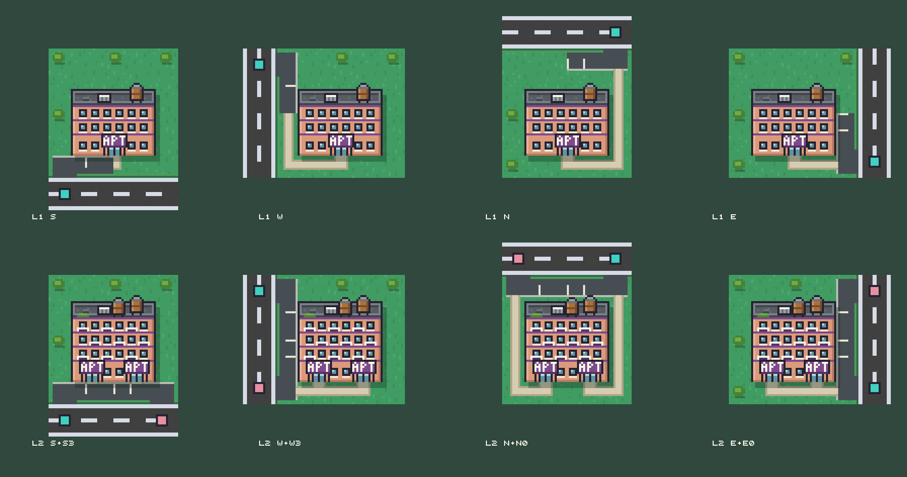

# Apartment building artwork

2026-09-13. Artwork only. The apartment houses several residents and upgrades from one entrance to two, in the style of the approved home lots and bus depot and easy to tell apart from them.

**v2 (current):** the second entrance is a player choice. The fixed primary never moves, and every frame draws exactly the driveways that lot has, so a lot never shows an unused driveway on the original street side. 64 frames ship as one 512x512 sheet plus a JSON manifest in this folder, so the approved city atlas is untouched.

 · [Entrance choices: same side, both corners, opposite side](review-choices.png) · [On a street of homes](review-neighborhood.png) · [Native size](review-neighborhood-native.png)

Teal marks the fixed primary entrance tile, pink the chosen second one. In game the access arrow does this.

## Entrance contract

4x4 lot, 16px tiles, sprite origin at lot tile (0,0), so one frame is 64x64 and the entrance tiles are the road tiles just outside it.

The 16 cardinal perimeter tiles, in world-aligned lot offsets:

| Side | Tiles |
| --- | --- |
| North | x 0..3, y -1 |
| East | x 4, y 0..3 |
| South | x 0..3, y 4 |
| West | x -1, y 0..3 |

The primary entrance is fixed by rotation and follows the home-corner rule. An upgrade never moves it:

| Rotation | Side | Offset | World offset |
| --- | --- | --- | --- |
| 0 | S | x 0 | (0, 4) |
| 1 | W | y 0 | (-1, 0) |
| 2 | N | x 3 | (3, -1) |
| 3 | E | y 3 | (4, 3) |

Level 2 adds one second entrance, freely chosen from the other 15 perimeter tiles, including a different side for a corner lot. That is 4 level-1 frames plus 4 x 15 level-2 frames, 64 in total.

## Sheet and manifest

- `apartment-sheet.png`, 512x512, 8 x 8 grid of 64x64 frames.
- `apartment-sheet.json`, one entry per frame with `x, y, w, h`, `level`, `rotation`, `floors`, `cars`, and `primary` / `secondary` entrances carrying both the side/offset and the world offset. It also lists `primaryByRotation` and all 16 `perimeterTiles`, so integration does not have to re-derive the geometry.
- `apartment-frames.ts`, the same 64 rectangles as a copy-in TypeScript table.

Frame keys:

- level 1: `apartment_1_<primarySide>`, for example `apartment_1_S`.
- level 2: `apartment_2_<primarySide>_<secondSide>_<secondOffset>`, for example `apartment_2_S_N_0`.
- Offsets are world axis: N and S offsets are x 0..3, E and W offsets are y 0..3.

Finite variants rather than layers: one texture lookup per lot, no runtime composition, and the driveway, hedge gap, walk and parking stalls stay consistent in each combination.

### Integration

Nothing outside this folder was written. To adopt the sheet:

1. copy `apartment-sheet.png` to wherever the renderer loads it from (`src/game/cityApartmentArt.ts`, written by another agent, currently expects `public/images/city/apartment-atlas.png`);
2. copy `apartment-frames.ts` (generated here, 64 rectangles keyed exactly as above) to the frame table that module imports.

`apartmentArtKey()` in that module already builds the same keys from `rotation` and the saved second entrance, so the art needs no other lookup. Frames are packed row-major: level 1 first (rotations 0..3), then each rotation's 15 level-2 choices in perimeter order N, E, S, W.

## Look

- **Shared by both levels:** coral stucco block with a grid of windows and plum floor bands, flat charcoal roof with parapet, rooftop water tank and AC unit, plum lobby canopy with an **APT** plate, striped parking behind a hedge. No other building uses plum or a flat roof with a water tank, and the art has no yellow (reserved for waiting markers).
- **Level 1:** three floors, one lobby, one driveway, two parking stalls.
- **Level 2:** four floors with balconies, a second tank and roof planter, two lobbies, two driveways, four parking stalls, and a bench courtyard wherever the chosen layout left room. The stall count matches the simulation: two household cars at level 1, four at level 2.
- The block is upright in every frame and pixel-identical across all 64 (verified). Only paving, walks and garden change with the chosen entrances.

## What changed from v1, and why

v1 placed the block against the entrance edge and ran a deep parking lane along that one edge. That only works when both driveways are on the same street: with a north primary the block sat two pixels from the north border, leaving no room to draw a south or east choice.

v2 centres the block (x 11..52) and grows it upward from a fixed base line (y 53), which leaves an 11px service ring on all four edges. Each entrance then paves its own mouth through the hedge plus one tile of parking lane, and a thin walk runs around the ring from the nearest lobby to that pavement. The building drawing itself is unchanged from the approved v1 design.

Two rules keep the read honest:

- Lane asphalt is held 2px clear of the neighbouring lot borders, so the only paving that reaches a lot edge is a real driveway mouth.
- Walks are never painted across lane asphalt; they stop where the pavement starts.

v1 is preserved unchanged for comparison: `apartment-{1,2}-{south,west,north,east}.png`, `all-sides.png`, `neighborhood.png`, `neighborhood-native.png` and `generate-v1.mjs`.

## Not decided here

Upgrade cost, how the model picks which entrance a car uses, when the player is offered the choice, and the renderer's own entrance arrow. Resident counts and household cars are taken from the simulation (2 and 4) only to draw the right number of stalls.

## Provenance and regeneration

[generate.mjs](generate.mjs), authored by Claude Code. Grass and road tiles are sampled from Kenney Roguelike Modern City frames in the runtime atlas (CC0); everything else is drawn in code. No image-generation service was used.

```sh
nix develop -c node docs/artwork/housing/apartment/generate.mjs   # sheet, manifest, review sheets
nix develop -c node docs/artwork/housing/apartment/verify.mjs     # checks the sheet against the manifest
nix develop -c node docs/artwork/housing/apartment/zoom.mjs apartment_2_S_N_0 apartment_2_S_E_3   # writes zoom.png
```

`generate.mjs` uses the shared `tools/png.mjs`. This workspace had no `node_modules`, and installing its `pngjs` dependency was out of scope, so the generator falls back to `png-nodeps.mjs` here: the same API and pixel helpers with PNG coding done through node's built-in zlib. When `pngjs` is installed the shared tool is used instead and the output is the same.

## Verification

- `verify.mjs` passes on all 64 frames: frames unique and in bounds; every declared entrance tile has a driveway mouth at least 10px wide cut to the lot edge and no other perimeter tile has one; each rotation keeps its level-1 primary across all 15 level-2 choices, and never repeats it as the second entrance; the building region is pixel-identical across every frame of a level.
- Visually inspected at 6x (single frames), 4x (review sheets) and native size beside the approved homes: same-side, both corner and opposite-side choices, all four rotations.
- Not checked in the running game, at phone zoom, or with the renderer's labels and entrance arrows, because nothing is integrated yet. No performance work was done.
