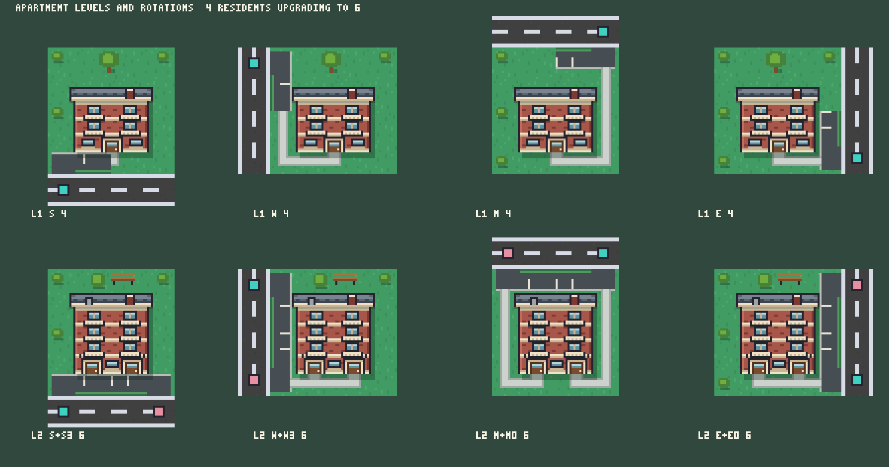

# Residential apartment block artwork

**Integration update2026-09-13:** User approved these sprites; Codex packed them unchanged into the runtime atlas and connected level/entrance selection. The artwork-only delivery notes below describe Claude’s original handoff.

2026-09-13. Artwork only, **not installed**. The game still shows its code placeholders; the lead
reviews these outputs before anything is adopted.

A modest red-brick walk-up on a 4x4 lot: four residents upgrading to six, with a fixed primary
driveway and a player-chosen second one. It is a new design, not an edit of the coral/plum block,
because that block is now the office. 64 frames ship as one 512x512 sheet plus a JSON manifest, so
the approved city atlas and the house art are untouched.

 · [Entrance choices: same side, both corners, opposite
side](review-choices.png) · [Four blocks on adjoining lots](review-community.png) ·
[On a street of homes](review-neighborhood.png) · [Beside a home and an office](review-vs-office.png) ·
[Native size](review-vs-office-native.png), [and again](review-neighborhood-native.png)

Teal marks the fixed primary entrance tile, pink the chosen second one. In game the access arrow
does this.

## The look, and how it stays distinct

Red brick with light masonry courses, cream string courses at every floor, cream balconies, a
shallow grey shingle roof with overhanging eaves and a cream gutter, a brick chimney, and timber
doors in cream surrounds. No plum and no signage: those belong to the office. Nothing is yellow,
which stays reserved for waiting markers.

Against the two buildings it has to be told apart from at play zoom (one native pixel is about
three screen pixels):

| | Apartment (here) | Homes | Office |
| --- | --- | --- | --- |
| Footprint | 38 wide (42 across the eaves), 33px then 41px tall, on a 4x4 lot | 32x32 sprite on a 2x2 lot | 42 wide, 34px then 41px tall, on a 4x4 lot |
| Body | red brick | cream render | coral stucco |
| Roof | grey shingle, long ridge, cream gutter, eaves | small pitched red or blue-grey roof | flat charcoal parapet with gravel and plant |
| Front | repeated identical units with cream balconies | one door, varied windows | ribbon glazing under a plum **OFFICE** plaque |

**The resident count is drawn, not labelled.** One balconied unit per resident: level 1 has two
upper floors of two units (4 residents), level 2 adds a third floor and a second front door
(6 residents). You can count them. The ground floor is the shared entrance, so it carries two
windows and one door at level 1, and one window and two doors at level 2.

Parking stripes are decorative. Two bays are drawn per driveway at both levels; that is **not** a
claim about the 4 and 6 cars the simulation parks. Only the entrance geometry is a contract.

## Modular for connected communities

The block is narrower than its lot, and the planted verge is drawn only beside paving, never as a
wall or a road around the whole lot. Blocks on adjoining lots therefore read as one development
rather than four fenced islands: see [review-community.png](review-community.png), four blocks
mixing both levels along one street. Nothing is drawn outside the lot, so a community road built
between blocks lands on clear ground.

## Entrance contract

4x4 lot, 16px tiles, sprite origin at lot tile (0,0), so one frame is 64x64 and the entrance tiles
are the road tiles just outside it.

The 16 cardinal perimeter tiles, in world-aligned lot offsets:

| Side | Tiles |
| --- | --- |
| North | x 0..3, y -1 |
| East | x 4, y 0..3 |
| South | x 0..3, y 4 |
| West | x -1, y 0..3 |

The primary entrance is fixed by rotation and follows the home-corner rule. An upgrade never moves
it:

| Rotation | Side | Offset | World offset |
| --- | --- | --- | --- |
| 0 | S | x 0 | (0, 4) |
| 1 | W | y 0 | (-1, 0) |
| 2 | N | x 3 | (3, -1) |
| 3 | E | y 3 | (4, 3) |

Level 2 adds one second entrance, freely chosen from the other 15 perimeter tiles, including a
different side for a corner lot. That is 4 level-1 frames plus 4 x 15 level-2 frames, 64 in total,
and every frame draws exactly the driveways that lot has: a lot never shows an unused driveway onto
a street it has not paid for.

The block is centred and grows upward from a fixed base line (y 53), which leaves an 11px service
ring on all four edges. Each entrance paves its own mouth through the verge plus one tile of parking
lane, and a concrete walk runs around the ring from the nearest front door to that pavement. Two
rules keep the read honest: lane asphalt is held 2px clear of the neighbouring lot borders, and
walks are never painted across lane asphalt, so each walk visibly ends where that lot's own pavement
begins.

## Sheet and manifest

- `apartment-sheet.png`, 512x512, 8 x 8 grid of 64x64 frames.
- `apartment-sheet.json`, one entry per frame with `x, y, w, h`, `level`, `rotation`, `floors`,
  `residents`, `units`, and `primary` / `secondary` entrances carrying both the side/offset and the
  world offset. It also lists `primaryByRotation` and all 16 `perimeterTiles`, so integration does
  not have to re-derive the geometry.
- `apartment-frames.ts`, the same 64 rectangles as a copy-in TypeScript table.

Frame keys:

- level 1: `apartment_1_<primarySide>`, for example `apartment_1_S`.
- level 2: `apartment_2_<primarySide>_<secondSide>_<secondOffset>`, for example
  `apartment_2_S_N_0`.
- Offsets are on the world axis: N and S offsets are x 0..3, E and W offsets are y 0..3.

Finite variants rather than layers: one texture lookup per lot, no runtime composition, and the
driveway, verge gap, walk and parking stripes stay consistent in each combination. Frames are packed
row-major: level 1 first (rotations 0..3), then each rotation's 15 level-2 choices in perimeter
order N, E, S, W.

> **Naming note.** These files share their names and key prefix with
> `docs/artwork/housing/apartment/`, which is the *preserved original coral/plum source* now
> reclassified as the office. That folder is reference only and was left byte-for-byte alone. The
> residential art the lead should review is the one in **this** folder.

## Regeneration

Everything is drawn in code; run from the repository root:

```sh
nix develop -c node docs/artwork/housing/residential-apartment/generate.mjs   # sheet, manifest, frame table, review sheets
nix develop -c node docs/artwork/housing/residential-apartment/verify.mjs     # checks the sheet against the manifest
nix develop -c node docs/artwork/housing/residential-apartment/zoom.mjs apartment_1_S apartment_2_S_N_0   # writes zoom.png at 6x
```

`generate.mjs` owns the block and its garden. `lot-kit.mjs` holds everything both lot types share:
palette, 3x5 font, entrance geometry, edge paving, the walk ring, the sheet packer and the
review-sheet builder. It is duplicated byte-for-byte in `docs/artwork/offices/lot-kit.mjs` on
purpose, so either folder can be moved or regenerated without the other; if you change one, `diff`
them and copy it across.

`review-vs-office.png` reads one frame out of the office sheet next door if it exists, and is
skipped if it does not. Everything else in this folder is self-contained.

Regeneration is deterministic: rerunning `generate.mjs` reproduces the same sheet bytes.

## Provenance

Authored by Claude Code. Grass and road tiles are sampled from the Kenney Roguelike Modern City
frames already in the runtime atlas (CC0); everything else is drawn pixel by pixel in code. **No
image-generation service was used, and no source or reference image was shared with any external
service.**

PNG coding uses `png-nodeps.mjs` in this folder (node's built-in `zlib`, no dependencies) so the
generator runs whether or not `node_modules` is present.

## Verification

- `verify.mjs` passes on all 64 frames: 64 unique in-bounds frames on a 512x512 sheet; every
  declared entrance tile has a driveway mouth at least 10px wide cut to the lot edge and no other
  perimeter tile has one; declared world offsets match the N/S = x, E/W = y contract; every key
  matches its own entrances; each rotation keeps its level-1 primary across all 15 level-2 choices
  and never repeats it as the second entrance; the block is pixel-identical across every frame of a
  level (upright, never moved); the balcony rails really count 4 units at level 1 and 6 at level 2,
  matching the `residents` the manifest declares; level 2 is taller than level 1 and neither level
  reaches into the 11px service ring.
- Visually inspected at 6x (single frames), 4x (review sheets) and native size: all four rotations
  at both levels, same-side, both-corner and opposite-side second entrances, four blocks on
  adjoining lots, and a street mixing homes, an office and both apartment levels.

## Limits

- Nothing is installed. No file in `src/`, `public/`, the city atlas, the house art, the preserved
  original block, `AGENTS.md` or any save was written or read-modified by this work, and nothing was
  committed or published.
- Not checked in the running game, at phone zoom, or with the renderer's own labels and entrance
  arrows, because nothing is integrated yet. Service-building labels have covered new roof detail
  before (see `docs/IMPLEMENTATION-LESSONS.md`), so that check is still owed at integration.
- No performance, CPU or FPS work was done, and none is claimed.
- Player recognition is unmeasured. The apartment/home/office separation is a visual judgement made
  at native size, not a playtest result.
- The community sheet shows that blocks tile without fighting each other. It does not model the
  joined-complex UI, community-road speed, or how a shared entrance behaves when its approach
  blocks.
- Upgrade cost, which entrance a car picks, and when the player is offered the choice are model
  decisions and are not made here.

## Integration, when the lead approves

1. Copy `apartment-sheet.png` to wherever the renderer loads it from.
2. Copy `apartment-frames.ts` (64 rectangles, keyed exactly as above) into the frame table that
   module imports.

The keys are built from `rotation` plus the saved second entrance, which the model already stores,
so the art needs no other lookup and no save migration.
