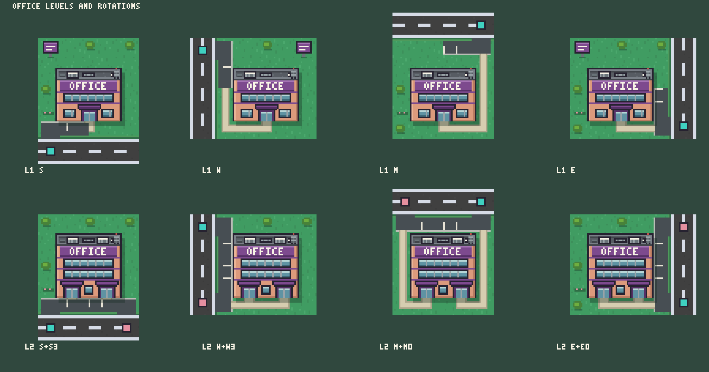

# Office lot artwork

**Integration update2026-09-13:** User approved these sprites; Codex packed them unchanged into the runtime atlas and connected level/entrance selection. The artwork-only delivery notes below describe Claude’s original handoff.

2026-09-13. Artwork only, **not installed**. The game still shows its code placeholders; the lead
reviews these outputs before anything is adopted.

The user reclassified the original coral/plum 4x4 block as an office. This folder keeps that
identity and lightly adapts it for office use, with a fixed primary driveway and a player-chosen
second one. 64 frames ship as one 512x512 sheet plus a JSON manifest, so the approved city atlas,
the house art and the preserved original block are all untouched.

 · [Entrance choices: same side, both corners, opposite
side](review-choices.png) · [On a street of homes](review-neighborhood.png) ·
[Native size](review-neighborhood-native.png)

Teal marks the fixed primary entrance tile, pink the chosen second one. In game the access arrow
does this.

## What changed from the original block, and what did not

Preserved from `docs/artwork/housing/apartment/` (left byte-for-byte alone as the reference):
the coral stucco body, plum banding, flat charcoal roof with parapet and gravel, the planted verge
along every street edge, and the 64x64 / 4x4-lot geometry.

Adapted for office identity:

| | Office (here) | Original block (reference) |
| --- | --- | --- |
| Signage | plum plaque under the parapet reading **OFFICE**, framed by coral | small `APT` plates on the lobby canopies |
| Windows | continuous ribbon glazing with metal mullions, glazed ground-floor shopfront | punched residential window grid |
| Roof | condensers, a duct run, a comms mast with a dish | water tanks, roof planter |
| Street | plum pylon sign on the forecourt, clipped planting | bench courtyard, shrubs |
| Height | 2 storeys, 3 after the upgrade | 3 floors, 4 after the upgrade |

The block keeps the original's width (42px, x 11..52) and sits within a pixel of its height: 34px at
level 1 and 41px at level 2, against the original's 33 and 40. It reads as the same building family
seen from the same camera.

**Capacity is not drawn.** 8 work spaces upgrading to 16 is provisional model data; it is recorded
in the manifest as `desks` and nothing in the art counts desks or stalls. The parking stripes are
decorative. Only the entrance geometry is a contract.

## Entrance contract

4x4 lot, 16px tiles, sprite origin at lot tile (0,0), so one frame is 64x64 and the entrance tiles
are the road tiles just outside it.

The 16 cardinal perimeter tiles, in world-aligned lot offsets:

| Side | Tiles |
| --- | --- |
| North | x 0..3, y -1 |
| East | x 4, y 0..3 |
| South | x 0..3, y 4 |
| West | x -1, y 0..3 |

The primary entrance is fixed by rotation and follows the home-corner rule. An upgrade never moves
it:

| Rotation | Side | Offset | World offset |
| --- | --- | --- | --- |
| 0 | S | x 0 | (0, 4) |
| 1 | W | y 0 | (-1, 0) |
| 2 | N | x 3 | (3, -1) |
| 3 | E | y 3 | (4, 3) |

Level 2 adds one second entrance, freely chosen from the other 15 perimeter tiles, including a
different side for a corner lot. That is 4 level-1 frames plus 4 x 15 level-2 frames, 64 in total,
and every frame draws exactly the driveways that lot has: a lot never shows an unused driveway onto
a street it has not paid for.

The block is centred (x 11..52) and grows upward from a fixed base line (y 53), which leaves an
11px service ring on all four edges. Each entrance paves its own mouth through the verge plus one
tile of parking lane, and a walk runs around the ring from the nearest entrance canopy to that
pavement. Two rules keep the read honest: lane asphalt is held 2px clear of the neighbouring lot
borders, and walks are never painted across lane asphalt, so each walk visibly ends where that
lot's own pavement begins.

## Sheet and manifest

- `office-sheet.png`, 512x512, 8 x 8 grid of 64x64 frames.
- `office-sheet.json`, one entry per frame with `x, y, w, h`, `level`, `rotation`, `floors`,
  `desks`, and `primary` / `secondary` entrances carrying both the side/offset and the world
  offset. It also lists `primaryByRotation` and all 16 `perimeterTiles`, so integration does not
  have to re-derive the geometry.
- `office-frames.ts`, the same 64 rectangles as a copy-in TypeScript table.

Frame keys:

- level 1: `office_1_<primarySide>`, for example `office_1_S`.
- level 2: `office_2_<primarySide>_<secondSide>_<secondOffset>`, for example `office_2_S_N_0`.
- Offsets are on the world axis: N and S offsets are x 0..3, E and W offsets are y 0..3.

Finite variants rather than layers: one texture lookup per lot, no runtime composition, and the
driveway, verge gap, walk and parking stripes stay consistent in each combination. Frames are
packed row-major: level 1 first (rotations 0..3), then each rotation's 15 level-2 choices in
perimeter order N, E, S, W.

## Regeneration

Everything is drawn in code; run from the repository root:

```sh
nix develop -c node docs/artwork/offices/generate.mjs                    # sheet, manifest, frame table, review sheets
nix develop -c node docs/artwork/offices/verify.mjs                      # checks the sheet against the manifest
nix develop -c node docs/artwork/offices/zoom.mjs office_1_S office_2_S_N_0   # writes zoom.png at 6x
```

`generate.mjs` owns the office building and its forecourt. `lot-kit.mjs` holds everything both lot
types share: palette, 3x5 font, entrance geometry, edge paving, the walk ring, the sheet packer and
the review-sheet builder. It is duplicated byte-for-byte in
`docs/artwork/housing/residential-apartment/lot-kit.mjs` on purpose, so either folder can be moved
or regenerated without the other; if you change one, `diff` them and copy it across.

Regeneration is deterministic: rerunning `generate.mjs` reproduces the same sheet bytes.

## Provenance

Authored by Claude Code. Grass and road tiles are sampled from the Kenney Roguelike Modern City
frames already in the runtime atlas (CC0); everything else is drawn pixel by pixel in code. **No
image-generation service was used, and no source or reference image was shared with any external
service.**

PNG coding uses `png-nodeps.mjs` in this folder (node's built-in `zlib`, no dependencies) so the
generator runs whether or not `node_modules` is present.

## Verification

- `verify.mjs` passes on all 64 frames: 64 unique in-bounds frames on a 512x512 sheet; every
  declared entrance tile has a driveway mouth at least 10px wide cut to the lot edge and no other
  perimeter tile has one; declared world offsets match the N/S = x, E/W = y contract; every key
  matches its own entrances; each rotation keeps its level-1 primary across all 15 level-2 choices
  and never repeats it as the second entrance; the block is pixel-identical across every frame of a
  level (upright, never moved); level 2 is taller than level 1 and neither level reaches into the
  11px service ring.
- Visually inspected at 6x (single frames), 4x (review sheets) and native size beside the approved
  homes: all four rotations at both levels, and same-side, both-corner and opposite-side second
  entrances.

## Limits

- Nothing is installed. No file in `src/`, `public/`, the city atlas, the house art, the preserved
  original block, `AGENTS.md` or any save was written or read-modified by this work, and nothing was
  committed or published.
- Not checked in the running game, at phone zoom, or with the renderer's own labels and entrance
  arrows, because nothing is integrated yet. Service-building labels have covered new roof detail
  before (see `docs/IMPLEMENTATION-LESSONS.md`), so that check is still owed at integration.
- No performance, CPU or FPS work was done, and none is claimed.
- Player recognition is unmeasured. The office/home/apartment separation is a visual judgement made
  at native size, not a playtest result.
- Upgrade cost, which entrance a car picks, and when the player is offered the choice are model
  decisions and are not made here.

## Integration, when the lead approves

1. Copy `office-sheet.png` to wherever the renderer loads it from.
2. Copy `office-frames.ts` (64 rectangles, keyed exactly as above) into the frame table that module
   imports.

The keys are built from `rotation` plus the saved second entrance, which the model already stores,
so the art needs no other lookup and no save migration.
