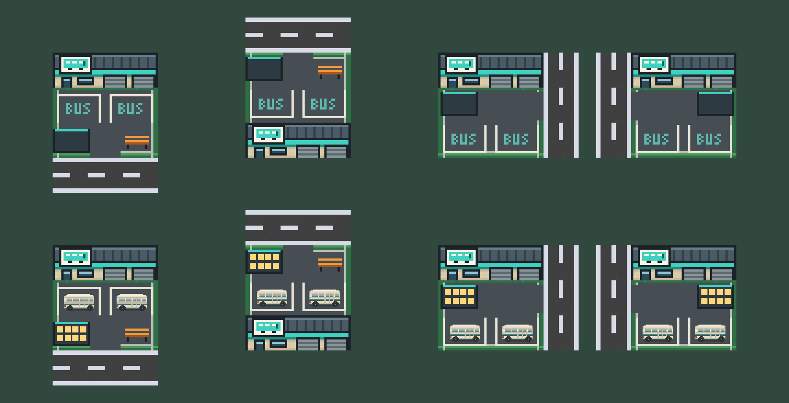

# Bus depot artwork

2026-09-13. The user asked for a best-effort depot improvement using its larger 3×3 lot, after approving the home lots and revising the bus stops for readability. Buses run their route, return to the depot and park; with no bus parked the empty bays must still read as parking. **Integrated; awaiting user selection** under the AGENTS.md artwork boundary. The previous look (paving, a squashed shopfront, outlined bays and a drawn teal sign) is in git history.

- One 48×48 native sprite per entrance side (`bus-depot-{south,west,north,east}.png`), packed as `busStation_{side}` frames.
- **Transit hall:** seamed metal roof, cream facade with a teal band, a large white sign with a teal bus, an office door and window, and two workshop roller doors.
- **Parking bays:** white bay lines on dark asphalt with teal BUS lettering, so empty bays still read as bus parking. Parked cream buses stand out against the asphalt.
- **Rider platform:** dark pad with a teal edge where the scene draws its yellow waiting-rider markers. Nothing in the art is yellow.
- **Lot edge:** hedge and curb around the apron, open only at the real driveway (middle tile of the entrance side). For side entrances an aisle runs in from the driveway with the bays below it and the platform at the far end; for a north entrance the hall moves to the bottom so the driveway reaches the top edge. Artwork never rotates.

`DEPOT_LAYOUT` in `src/game/cityArt.ts` mirrors the generator's `LAYOUT`: `cityScene.ts` parks buses on each side's bay centres and places depot rider markers on its platform, so art and renderer stay aligned. Footprint, entrance, fleet limits, routes, riders and saves are unchanged.

Provenance: [generate.mjs](generate.mjs), authored by Claude Code. Grass and sand wall texture are sampled from Kenney Roguelike Modern City frames in the runtime atlas (CC0); everything else is drawn in code. No image-generation service was used. Regenerate with `nix develop -c node docs/artwork/transit/bus-depot/generate.mjs`, then `nix develop -c node tools/build-city-atlas.mjs`.

Verification: typecheck and production build pass. [browser-check.mjs](browser-check.mjs) places depots for all four entrance sides, buys two buses for each and confirms they park, with no page errors; see `in-game-1440.png`, `in-game-1440-zoom.png` and `in-game-390.png`. Live waiting riders at a depot were not captured in-game; the review sheet reproduces the scene's marker positions. Physical-device readability is unmeasured.
