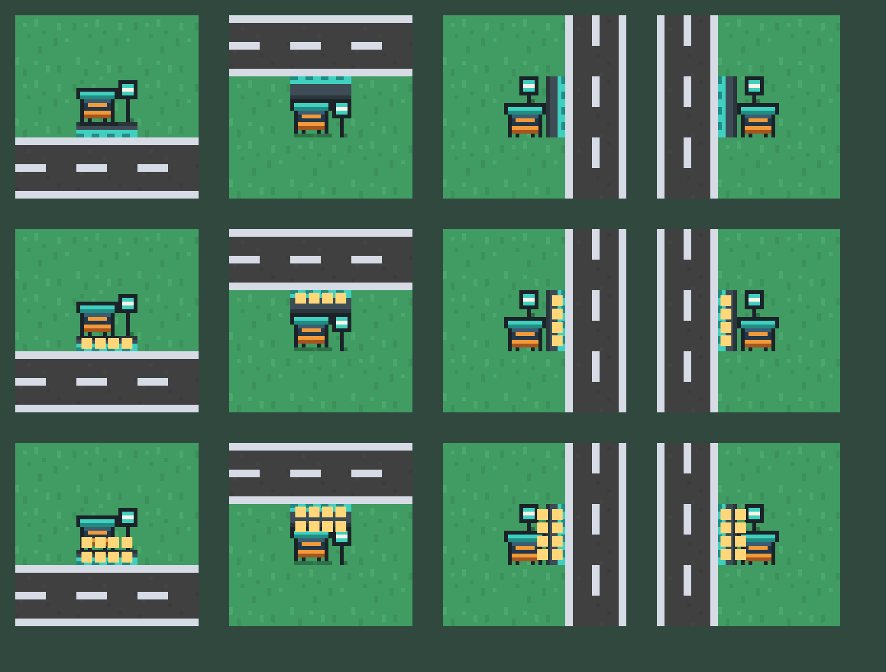

# Bus stop artwork

2026-09-13. After approving the home lots, the user asked to improve the bus stops. **Integrated; awaiting user selection** under the AGENTS.md artwork boundary. The previous look (paving, flat teal sign and frontage line drawn in `cityScene.ts`) is in git history.

- One 16×16 native sprite per boarding side (`bus-stop-{south,west,north,east}.png`), packed as `busStop_{side}` frames: an ink-outlined teal canopy over a dark back wall with a bright orange bench (backrest, seat, legs), a teal pole sign with a white bus bar, and a dark waiting pad edged by a teal boarding curb.
- Readability revision (same day): the user reported the first version was hard to make out at play zoom (pale glass on grey paving) and that its yellow curb competed with the yellow waiting-rider markers. Everything is now bold outlined shapes with strong value contrast, and **nothing in the art is yellow**, so rider markers stay unambiguous on the dark pad. The review sheet draws 0, 4 and 8 riders exactly where `cityScene.ts` places them.
- The shelter never rotates; the curb, sign and waiting pad move to the boarding side. Waiting-rider markers now line up along that curb instead of always at the bottom of the square.
- Stop size, placement rules, curb direction, dwell, riders and saves are unchanged. The bus depot was redrawn separately; see [bus-depot](../bus-depot/README.md).

Provenance: [generate.mjs](generate.mjs), authored by Claude Code. Grass is sampled from the Kenney Roguelike Modern City `grassA` frame in the runtime atlas (CC0); everything else is drawn in code. No image-generation service was used. Regenerate with `nix develop -c node docs/artwork/transit/bus-stop/generate.mjs`, then `nix develop -c node tools/build-city-atlas.mjs`.

Verification: typecheck and production build pass. [browser-check.mjs](browser-check.mjs) places six stops across all four curb sides next to homes and a shop, with no page errors; see `in-game-390.png` and `in-game-1440.png`. Live waiting riders were not captured in-game (a fixture would need a running route); the review sheet reproduces the scene's marker positions instead. Physical-device readability is unmeasured.
